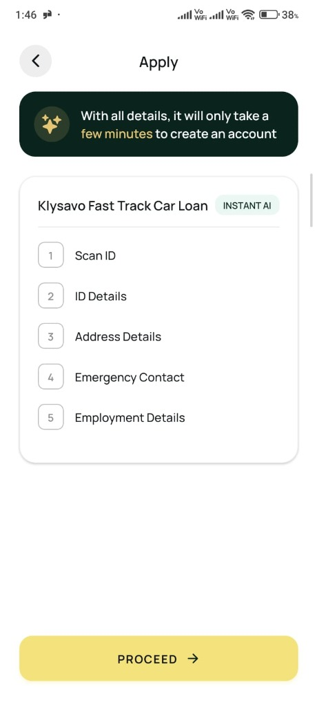
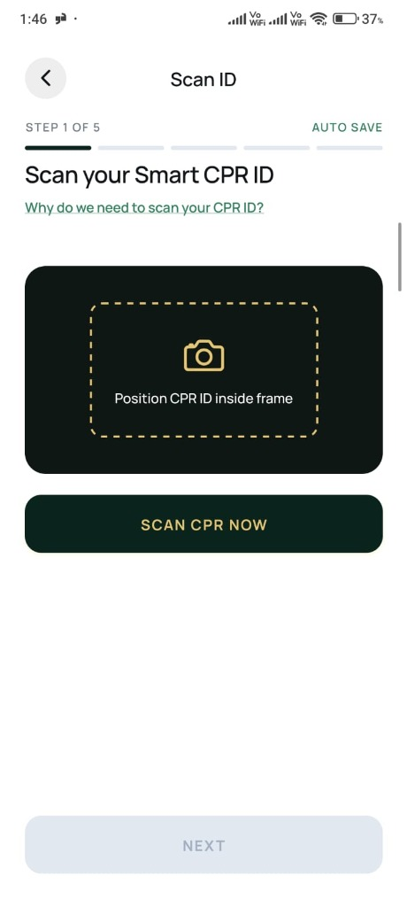
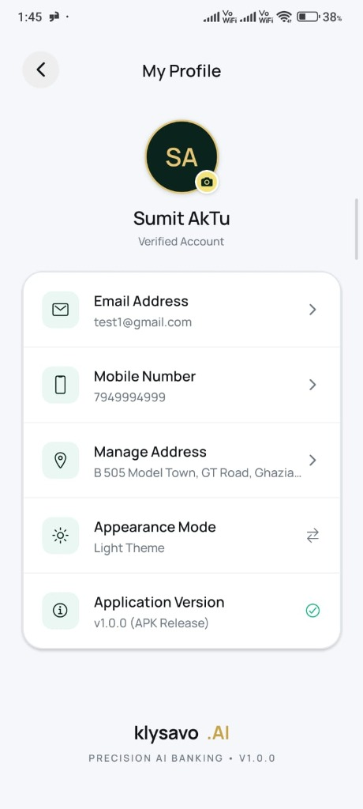
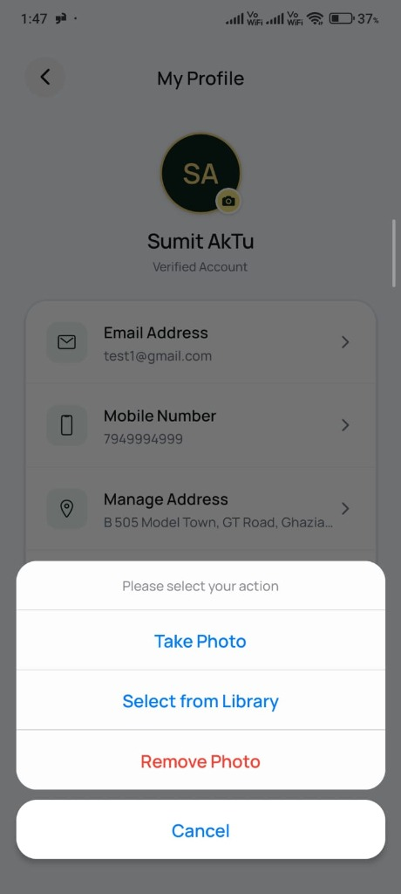
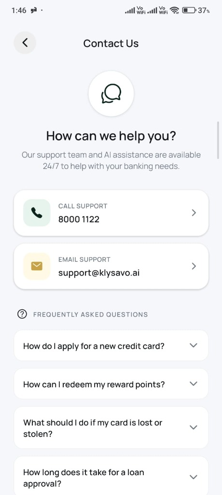

# Klysavo AI Banking 🏦✨
> **Precision Cross-Platform AI Banking & Financial Services Mobile Application**
> Built with **React Native**, **Expo SDK 54**, **TypeScript**, **Firebase Firestore**, and **Google Cloud Platform (GCP)**.

---

## 📥 Direct Standalone Release APK Download & Testing Credentials

> [!IMPORTANT]
> **Use the following credentials to test all live features, profile sync, and card applications:**
> - 📧 **Demo Login Email**: `test1@gmail.com`
> - 🔑 **Demo Password**: `12345678`
> - ⚡ **Generate Standalone APK**: Run `eas build --platform android --profile preview` or `cd android && ./gradlew assembleRelease`

---

## 📱 Visual Screen Showcase & App Screenshots

| Application Overview | CPR ID Scanner | User Profile Hub | Profile Photo Menu | 24/7 Support Hub |
| :---: | :---: | :---: | :---: | :---: |
|  |  |  |  |  |
| **5-Step Roadmap**<br/>Selected product & instant AI progress indicator | **Smart ID Scan**<br/>Real-time camera scanner with framing guide | **Verified Account**<br/>Profile options, dark mode toggle & version tag | **Photo Action Sheet**<br/>Compressed upload modal (Camera / Gallery) | **Support & FAQs**<br/>Direct hotlines & collapsible accordion FAQ |

---

## 📑 Step-by-Step Guide: How to Apply for a Card or Loan

Follow these simple steps inside the **Klysavo AI Banking** app to submit an instant AI-evaluated application:

```
[1. Select Product] ➡️ [2. AI Application Roadmap] ➡️ [3. Scan CPR ID] ➡️ [4. Verify ID & Address] ➡️ [5. Employment & Contact] ➡️ [6. Instant AI Decision]
```

### 🔹 Step 1: Select Your Desired Product
1. Log into the app using demo credentials (`test1@gmail.com` / `12345678`) or register a new account.
2. Navigate to the **Home**, **Cards**, or **Explore** tab.
3. Choose a card or loan product (e.g., *Klysavo Infinite Card*, *Imtiaz Gold Credit Card*, or *Fast Track Car Loan*) and tap **Apply Now** or **PROCEED**.

### 🔹 Step 2: Overview & 5-Step Roadmap
1. Review the application overview screen showing the **INSTANT AI** badge.
2. Confirm the 5 required steps:
   - **Step 1**: Scan ID
   - **Step 2**: ID Details
   - **Step 3**: Address Details
   - **Step 4**: Emergency Contact
   - **Step 5**: Employment Details
3. Tap **PROCEED ➔** to initiate the flow.

### 🔹 Step 3: Scan Your Smart CPR ID (Step 1/5)
1. Position your CPR / National ID inside the dashed camera framing guide (`Position CPR ID inside frame`).
2. Tap **SCAN CPR NOW** to capture or upload your ID document.
3. The AI OCR engine extracts your document details automatically. Tap **NEXT** to continue.

### 🔹 Step 4: Verify Personal & Address Details (Steps 2 & 3/5)
1. Confirm pre-filled personal details (CPR number, Full Name, Date of Birth, Gender).
2. Input your residence address details: Building/Villa Number, Road/Street Number, Block Number, and City/Area (*e.g., Manama*).
3. The app automatically saves your progress locally at every step (**AUTO SAVE** enabled).

### 🔹 Step 5: Provide Emergency Contact & Employment Information (Steps 4 & 5/5)
1. Enter an emergency contact person (Name, Relationship, Contact Phone Number).
2. Provide employment information (Employer Name, Job Title, Monthly Salary, Expenses/Obligations).

### 🔹 Step 6: Instant AI Evaluation & Approval
1. Tap **SUBMIT APPLICATION**.
2. The Klysavo AI Decision Engine instantly evaluates credit eligibility against banking guidelines.
3. Receive real-time status feedback (`APPROVED`, `PENDING`, or `DRAFT`) synchronized live across Firestore and the Cards dashboard!

---

## 🔒 Step-by-Step Guide: How to Freeze and Unfreeze Your Card

Klysavo provides instant security card controls allowing you to freeze or unfreeze your physical and virtual credit cards in real-time.

### ❄️ How to Freeze Your Card
1. Open the **Cards** tab from the bottom navigation bar (or use the **Quick Action** shortcut on the Home dashboard).
2. Select your active card (e.g., *Klysavo Infinite Card*, *Imtiaz Gold Credit Card*).
3. Locate the **FREEZE CARD** security toggle button under the card action controls.
4. Tap **FREEZE CARD**.
5. **Instant Feedback**: 
   - A top warning notification banner appears: *"Card frozen successfully. Transactions are temporarily blocked."*
   - Real-time Firestore state listener updates `isFrozen: true`.
   - Card status badge displays **FROZEN** and all payment transactions are instantly blocked.

### 🔥 How to Unfreeze Your Card
1. Navigate back to the **Cards** tab or Home Quick Actions.
2. Tap the **UNFREEZE CARD** button on your frozen card.
3. **Instant Feedback**:
   - A top success notification banner appears: *"Card unfrozen. Card is active for purchases."*
   - Real-time Firestore state listener updates `isFrozen: false`.
   - Card status returns to **ACTIVE** for online and point-of-sale transactions.

### 🛠️ Technical Security Specifications: Freeze & Unfreeze
- **Firestore Real-Time Broadcast**: Mutates `isFrozen` field on `klysavo_users/{uid}` via `setDoc(..., { merge: true })` and broadcasts changes to all active client devices via `onSnapshot`.
- **Encrypted Local Keychain Sync**: Encrypts and persists state in Expo `SecureStore` (`expo-secure-store`) for instant offline status retention.
- **Fail-Safe Transaction Interceptor**: Prevents authorization requests while `isFrozen === true`.

---

## 🏛️ Architecture, Scalability & Maintainability

Klysavo is built following **Clean Architecture**, **Domain-Driven Design (DDD)**, and the **MVVM (Model-View-ViewModel)** architectural pattern.

```
c:\Users\rsumi\Projects\Klysavo\
├── app/                      # Expo Router File-Based Typed Navigation Routes
│   ├── (auth)/               # Authentication Stack (Login, Register)
│   ├── (main)/               # Main App Tab Navigator (Home, Cards, Loans, Insurance, Explore)
│   ├── apply-card.tsx        # 5-Step Application Flow Route
│   └── financial-calculator  # Financial Eligibility Calculator Routes
├── assets/images/            # App Visual Assets & Screen Showcase Screenshots
├── src/
│   ├── core/                 # Shared Services (Firebase, SecureStore, Theme, Typography)
│   ├── features/             # Feature Modules (auth, home, card-application, rewards, profile, etc.)
│   │   ├── data/             # Repositories, DTOs & API Implementations
│   │   ├── domain/           # Entities, Models & Business Logic
│   │   └── presentation/     # Screen UI, Components & ViewModels (MVVM)
│   └── shared/               # Reusable Components (AppHeader, Modals, Pickers, StepProgressBar)
```

---

## ⚡ State Refreshing, API Integration & Data Synchronization

### 1. Live State Refreshing & Reactive UI
- **Firebase Firestore `onSnapshot` Listeners**: Real-time multi-document snapshot listeners bound to `klysavo_users` collection and `applications` sub-collections. Any DB mutation instantly re-evaluates local state without requiring manual page reloads.
- **Focus-Based Screen Refreshing**: Uses Expo Router's `useFocusEffect` hook to trigger light background syncs whenever navigating between tabs or returning from the apply flow.
- **React 19 Hooks Engine**: Built on lightweight React state primitives (`useState`, `useMemo`, `useCallback`, `useEffect`) to ensure zero unnecessary re-renders.

### 2. Dual-Layer Offline Persistence & Data Reconciliation
- **Hybrid Storage Architecture**: Combines local-first storage via Expo `SecureStore` (`expo-secure-store`) and `AsyncStorage` with background Firestore snapshot synchronization.
- **Error-Safe Application Draft Recovery**: `cleanAndDeduplicateApplications` normalizes application keys by status priority (`APPROVED` > `SUBMITTED` > `PENDING` > `DRAFT`) and recency. Draft data remains 100% intact offline.

---

## 📦 Package & Technology Stack Inventory

| Category | Package / Library | Description & Usage |
| :--- | :--- | :--- |
| **Core Framework** | `react-native` (v0.81.5) | Cross-platform UI runtime with Hermès JS engine. |
| **SDK & Routing** | `expo` (~54.0.35), `expo-router` (~6.0.24) | Expo SDK 54 file-based typed routing engine. |
| **Backend & Database**| `firebase` (^11.4.0) | Firebase Auth & Firestore real-time database. |
| **Secure Persistence**| `expo-secure-store`, `@react-native-async-storage/async-storage` | Encrypted device keychain & session storage. |
| **Image Processing** | `expo-image-picker`, `expo-image-manipulator` | Camera/gallery selection & client-side compression. |
| **UI & Animations** | `react-native-reanimated`, `@expo/vector-icons` | 60fps fluid UI animations & Ionicons iconography. |
| **Typography** | `@expo-google-fonts/manrope` | Custom Manrope font family (Regular to ExtraBold). |
| **Layout & Theme** | `react-native-safe-area-context`, `expo-status-bar` | Edge-to-edge layout & light/dark theme context. |

---

## 🛠️ Prerequisites & Local Setup Instructions

### 📋 Prerequisites
- **Node.js**: `v18.0.0` or higher (Recommended: `v20.x`)
- **npm**: `v9.x` or higher
- **Target**: Expo Go App, Android Emulator, or iOS Simulator.

### 🚀 Getting Started

1. **Clone the Repository**:
   ```bash
   git clone https://github.com/your-username/Klysavo.git
   cd Klysavo
   ```

2. **Install Dependencies**:
   ```bash
   npm install
   ```

3. **Configure Environment Variables**:
   Copy `.env.example` to `.env`:
   ```bash
   cp .env.example .env
   ```

4. **Start Development Server**:
   ```bash
   npx expo start
   ```

5. **Type Check & Linting**:
   ```bash
   npx tsc --noEmit
   npm run lint
   ```

---

## 📦 Building Standalone Release APK with ProGuard Obfuscation

```bash
# 1. Prebuild native Android project files
npx expo prebuild --platform android

# 2. Build obfuscated standalone Release APK via Gradle
cd android
./gradlew assembleRelease
```

**📍 Output APK Location**:
`android/app/build/outputs/apk/release/app-release.apk`

---

## 📄 License & Contact

Developed for **Klysavo Precision AI Banking**.  
For any setup questions or technical inquiries, feel free to reach out via GitHub Issues.
