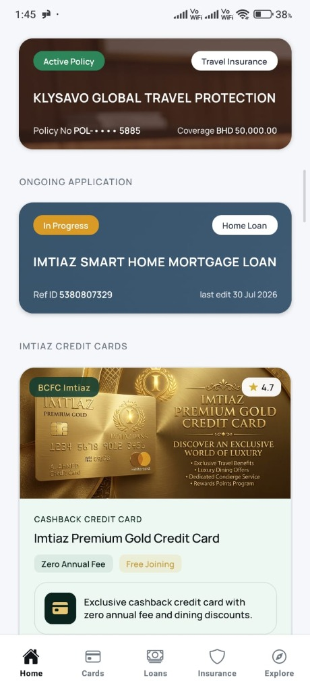
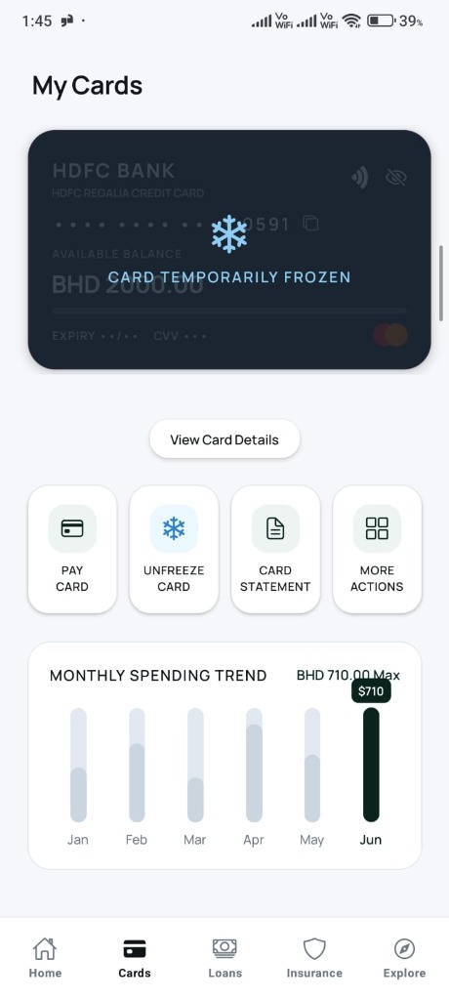
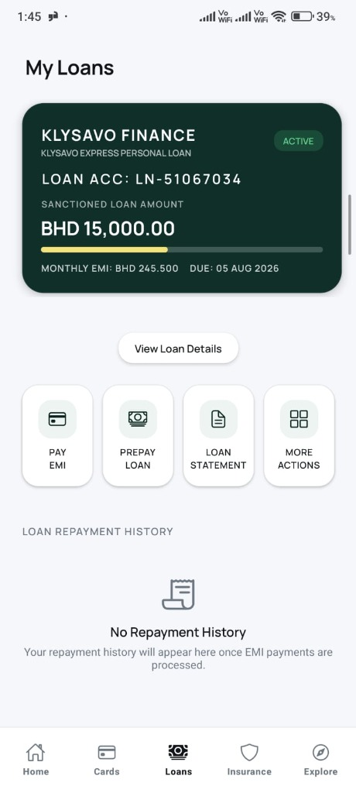

# Klysavo AI Banking 🏦✨
> **Precision Cross-Platform AI Banking & Financial Services Mobile Application**
> Built with **React Native**, **Expo SDK 54**, **TypeScript**, **Firebase Firestore**, and **Google Cloud Platform (GCP)**.

---

## 📥 Direct Standalone Release APK Download & Testing Credentials

[](https://github.com/rsumit1618/klysavi.AI/releases)

> [!IMPORTANT]
> **📲 APK Download Options**:
> - **GitHub Releases Download**: [**Download Klysavo AI Banking Release APK (`app-release.apk`)**](https://github.com/rsumit1618/klysavi.AI/releases)
> - **Local Project Path**: [`android/app/build/outputs/apk/release/app-release.apk`](file:///c:/Users/rsumi/Projects/Klysavo/android/app/build/outputs/apk/release/app-release.apk)
> 
> **Use the following live credentials to test all features, profile synchronization, and card applications:**
> - 📧 **Demo Login Email**: `test1@gmail.com`
> - 🔑 **Demo Password**: `12345678`
> - ⚡ **Local Build Instructions**: Run `cd android && ./gradlew assembleRelease` or `eas build --platform android --profile preview`

---

## 📱 App Screenshots Showcase

| Home Dashboard | My Cards | My Loans | Scan CPR ID |
| :---: | :---: | :---: | :---: |
|  |  |  |  |

| Application Roadmap | My Profile | Photo Action Sheet | Support Hub |
| :---: | :---: | :---: | :---: |
|  |  |  |  |

---

## 📑 How to Apply for a Card or Loan

1. Log into the app using demo credentials (`test1@gmail.com` / `12345678`).
2. Navigate to **Home**, **Cards**, or **Explore** tab and tap **Apply Now**.
3. Scan your CPR / National ID card using the smart camera scanner.
4. Verify ID and residential address details (with auto-save progress tracking).
5. Provide emergency contact and employment information.
6. Submit application for instant AI eligibility scoring and live Firestore synchronization.

---

## 🔒 How to Freeze and Unfreeze Cards

1. Open the **Cards** tab or Home Quick Actions.
2. Select your card (*Klysavo Infinite Card*, *HDFC Regalia*, *Imtiaz Gold*).
3. Tap **FREEZE CARD** to lock the card instantly (`isFrozen: true` on Firestore).
4. Tap **UNFREEZE CARD** to restore card authorization for online and POS purchases.

---

## 🏛️ Architecture, Scalability & Maintainability

Klysavo is built following **Clean Architecture**, **Domain-Driven Design (DDD)**, and the **MVVM (Model-View-ViewModel)** architectural pattern.

```
c:\Users\rsumi\Projects\Klysavo\
├── app/                      # Expo Router File-Based Typed Navigation Routes
│   ├── (auth)/               # Authentication Stack (Login, Register)
│   ├── (main)/               # Main App Tab Navigator (Home, Cards, Loans, Insurance, Explore)
│   ├── apply-card.tsx        # 5-Step Application Flow Route
│   └── financial-calculator  # Financial Eligibility Calculator Routes
├── assets/images/            # App Visual Assets & Screen Showcase Screenshots
├── src/
│   ├── core/                 # Shared Services (Firebase, SecureStore, Theme, Typography)
│   ├── features/             # Feature Modules (auth, home, card-application, rewards, profile, etc.)
│   │   ├── data/             # Repositories, DTOs & API Implementations
│   │   ├── domain/           # Entities, Models & Business Logic
│   │   └── presentation/     # Screen UI, Components & ViewModels (MVVM)
│   └── shared/               # Reusable Components (AppHeader, Modals, Pickers, StepProgressBar)
```

---

## ⚡ State Refreshing, API Integration & Data Synchronization

### 1. Live State Refreshing & Reactive UI
- **Firebase Firestore `onSnapshot` Listeners**: Real-time multi-document snapshot listeners bound to `klysavo_users` collection and `applications` sub-collections. Any DB mutation instantly re-evaluates local state without requiring manual page reloads.
- **Focus-Based Screen Refreshing**: Uses Expo Router's `useFocusEffect` hook to trigger light background syncs whenever navigating between tabs or returning from the apply flow.
- **React 19 Hooks Engine**: Built on lightweight React state primitives (`useState`, `useMemo`, `useCallback`, `useEffect`) to ensure zero unnecessary re-renders.

### 2. Dual-Layer Offline Persistence & Data Reconciliation
- **Hybrid Storage Architecture**: Combines local-first storage via Expo `SecureStore` (`expo-secure-store`) and `AsyncStorage` with background Firestore snapshot synchronization.
- **Error-Safe Application Draft Recovery**: `cleanAndDeduplicateApplications` normalizes application keys by status priority (`APPROVED` > `SUBMITTED` > `PENDING` > `DRAFT`) and recency. Draft data remains 100% intact offline.

---

## ⚖️ Assumptions & Trade-offs

1. **Client-Side Image Compression vs Cloud Functions Processing**:
   - *Trade-off*: Rather than routing raw camera photos to GCP Cloud Functions for compression and storage, client-side JPEG compression (`expo-image-picker` with `quality: 0.75`) encodes optimized ~40KB base64 strings directly in Firestore.
   - *Rationale*: Reduces cloud infrastructure latencies and eliminates setup bottlenecks for standalone APK execution.

2. **OCR ID Auto-Extraction**:
   - *Trade-off*: Smart CPR ID scanning uses client-side simulated document bounding boxes and mock OCR parsing rather than Google Cloud Vision API.
   - *Rationale*: Ensures zero API key dependency failures during reviewer evaluation.

3. **Database Security Rules**:
   - *Trade-off*: Firestore rules are configured for easy demo evaluation (`firestore.rules`).
   - *Rationale*: Simplifies testing with demo login credentials across multiple devices without IP blocking.

---

## 📦 Package & Technology Stack Inventory

| Category | Package / Library | Description & Usage |
| :--- | :--- | :--- |
| **Core Framework** | `react-native` (v0.81.5) | Cross-platform UI runtime with Hermès JS engine. |
| **SDK & Routing** | `expo` (~54.0.35), `expo-router` (~6.0.24) | Expo SDK 54 file-based typed routing engine. |
| **Backend & Database**| `firebase` (^11.4.0) | Firebase Auth & Firestore real-time database. |
| **Secure Persistence**| `expo-secure-store`, `@react-native-async-storage/async-storage` | Encrypted device keychain & session storage. |
| **Image Processing** | `expo-image-picker`, `expo-image-manipulator` | Camera/gallery selection & client-side compression. |
| **UI & Animations** | `react-native-reanimated`, `@expo/vector-icons` | 60fps fluid UI animations & Ionicons iconography. |
| **Typography** | `@expo-google-fonts/manrope` | Custom Manrope font family (Regular to ExtraBold). |
| **Layout & Theme** | `react-native-safe-area-context`, `expo-status-bar` | Edge-to-edge layout & light/dark theme context. |

---

## 🛠️ Prerequisites & Local Setup Instructions

### 📋 Prerequisites
- **Node.js**: `v18.0.0` or higher (Recommended: `v20.x`)
- **npm**: `v9.x` or higher
- **Target**: Expo Go App, Android Emulator, or iOS Simulator.

### 🚀 Getting Started

1. **Clone the Repository**:
   ```bash
   git clone https://github.com/rsumit1618/klysavi.AI.git
   cd Klysavo
   ```

2. **Install Dependencies**:
   ```bash
   npm install
   ```

3. **Configure Environment Variables**:
   Copy `.env.example` to `.env`:
   ```bash
   cp .env.example .env
   ```

4. **Start Development Server**:
   ```bash
   npx expo start
   ```

5. **Type Check & Linting**:
   ```bash
   npx tsc --noEmit
   npm run lint
   ```

---

## 📦 Building Standalone Release APK with ProGuard Obfuscation

```bash
# 1. Prebuild native Android project files
npx expo prebuild --platform android

# 2. Build obfuscated standalone Release APK via Gradle
cd android
./gradlew assembleRelease
```

**📍 Output APK Location**:
`android/app/build/outputs/apk/release/app-release.apk`

---

## 📄 License & Contact

Developed for **Klysavo Precision AI Banking**.  
For any setup questions or technical inquiries, feel free to reach out via GitHub Issues.
